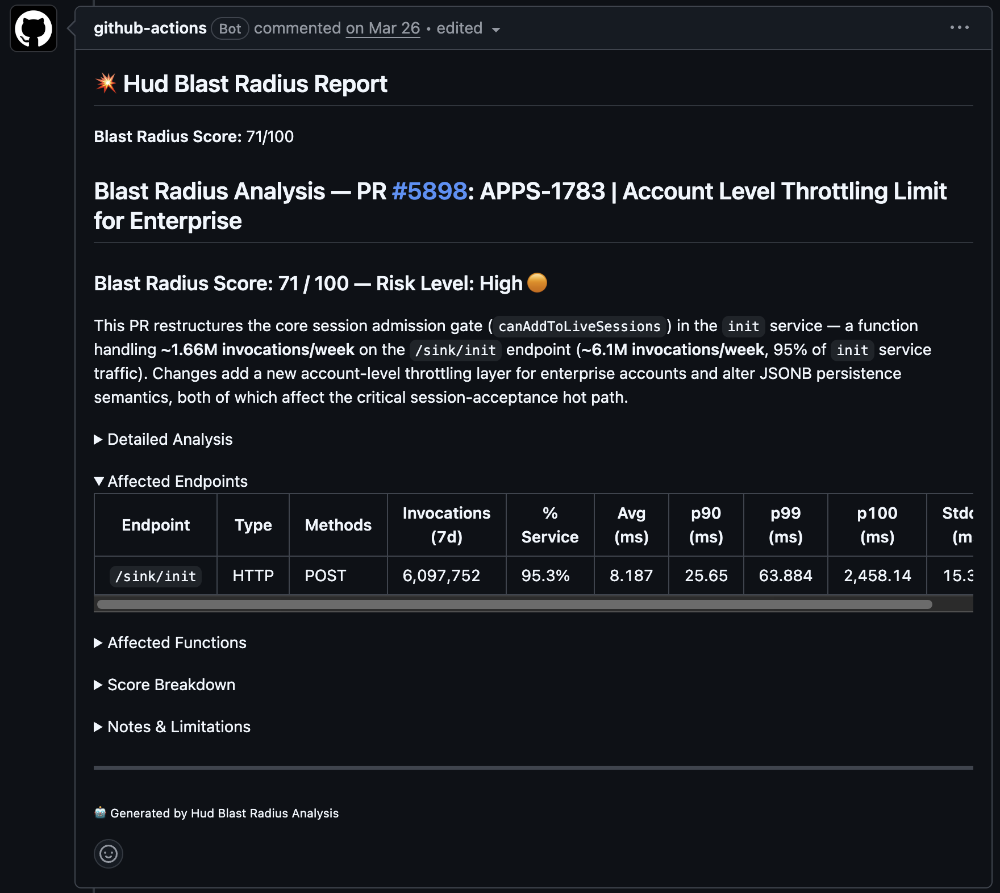

# Blast Radius (GitHub Actions)

> Score the production blast radius of every pull request and post the result as a comment.



When a PR is opened, this workflow asks Hud "what does production look like for the code this PR touches?" and turns the answer into a single 0-100 score plus a written report. Reviewers see at a glance whether they're looking at a one-line tweak to a hot path or a sweeping change to dead code.

## How to install

| Step | Action |
|---|---|
| **Copy to your repo** | `.github/workflows/pr-blast-radius.yml` → same path |
|  | `.github/actions/blast-radius/action.yml` → same path |
|  | `.github/actions/blast-radius/blast-radius-prompt.txt` → same path |
| **Configure in UI** | *(none)* |
| **Set secrets** | `HUD_MCP_KEY` - Hud dashboard → Settings → MCP keys |
|  | `ANTHROPIC_API_KEY` - console.anthropic.com (or [Bedrock](#bedrock-alternative)) |

## What it does

On every PR (or manual dispatch), the action:

1. Resolves the PR number and pulls the diff (with a 350 KB cap and graceful fallback for large diffs).
2. Cross-references touched code against Hud's production traffic data: invocations, traffic share, latency sensitivity, error rates, distinct endpoint counts.
3. Asks Claude to score the change on a weighted blast-radius rubric and write a markdown report.
4. Posts the report as a PR comment (configurable).
5. Surfaces a numeric `blast-radius-score` output (0-100) for downstream gating.

If the PR touches no Hud-tracked functions, the action exits gracefully without commenting.

## Files

| Path | Purpose |
|---|---|
| `.github/workflows/pr-blast-radius.yml` | Thin workflow that triggers on PR + dispatches and calls the action |
| `.github/actions/blast-radius/action.yml` | Composite action: installs Claude CLI, sets up MCP, runs the analysis |
| `.github/actions/blast-radius/blast-radius-prompt.txt` | The analysis prompt fed to Claude |

## Required permissions

```yaml
permissions:
  contents: read
  pull-requests: write
```

`pull-requests: write` is what lets the action post the PR comment.

## Inputs you might want to tweak

| Input | Default | When to change |
|---|---|---|
| `model` | `opus` | Pass `sonnet`/`haiku` for faster/cheaper runs, or a Bedrock model ID for the Bedrock route |
| `lookback-days` | `7` | Increase if your prod traffic is bursty week-over-week |
| `max-functions` | `80` | Raise for very large monorepos |
| `comment-on-pr` | `true` | Set `false` to gate via the score output instead of comments |
| `weight-*` | various | Re-tune the scoring rubric for your team's risk profile |

See `action.yml` for the full input list.

## Verify it works

1. Add `HUD_MCP_KEY` + `ANTHROPIC_API_KEY` as repo secrets.
2. Drop the three files into your repo.
3. Pick a file with known production traffic: open the Hud dashboard's Functions view, sort by invocations, and grab a top-ranked file. Modify any line in it.
4. Open a test PR. The workflow should run and post a comment within ~2-3 minutes.

## Bedrock alternative

If you're routing Claude via AWS Bedrock instead of the Anthropic API:

1. Add `permissions.id-token: write` to the workflow.
2. Add an `aws-actions/configure-aws-credentials@v4` step before the action call (template commented in `pr-blast-radius.yml`).
3. Set `CLAUDE_CODE_USE_BEDROCK: '1'`, `AWS_REGION: us-west-2`, and `ANTHROPIC_MODEL: 'anthropic.claude-sonnet-4-5-v2:0'` as **job-level** `env:` (commented stub in `pr-blast-radius.yml`). Composite-action inputs don't propagate to the inner Claude CLI step; env does.
4. Pass the Bedrock model ID through the `model` input (e.g. `model: 'anthropic.claude-sonnet-4-5-v2:0'`) and leave `anthropic-api-key:` empty.
5. Replace the `ANTHROPIC_API_KEY` secret with `AWS_ROLE_TO_ASSUME` (IAM role with `bedrock:InvokeModel` permission).

See [`docs/auth.md`](../../docs/auth.md) for the full Bedrock setup.

## Adapting it

- **Scope by team?** See [`recipes/team-splitting/`](../../recipes/team-splitting/).
- **Team-only:** gate by GitHub team membership. See [`recipes/team-splitting/2-github-teams/`](../../recipes/team-splitting/2-github-teams/).
- **Label-only:** only run when a specific label is set. Add a `check-label` job before `blast-radius`.
- **Path-only:** uncomment the `paths:` filter on `pull_request_target`.
- **Routing through AWS Bedrock?** See [`docs/auth.md`](../../docs/auth.md).
