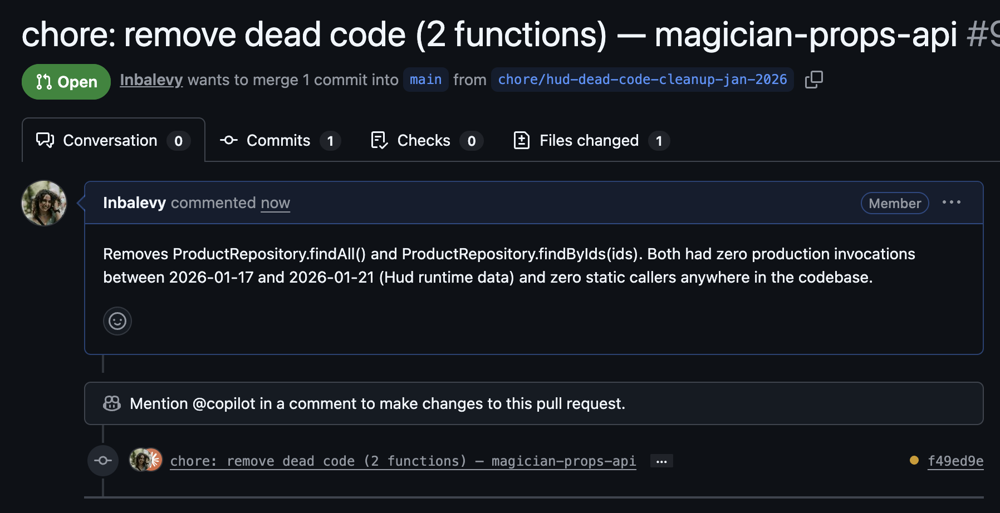

# Dead Code Cleanup (Cursor)

> Find zero-traffic functions, open a Jira ticket, and create a PR removing them.



Most codebases accumulate dead code at the rate of feature work. This workflow uses Hud's production runtime data to find functions with zero invocations over the last 60 days, runs safety checks (don't delete framework hooks, public APIs, dynamic references, etc.), and creates the cleanup as an automated PR.

## How to install

| Step | Action |
|---|---|
| **Copy to your repo** | `AGENTS.md` → repo root |
| **Configure in UI** | 1. [cursor.com/automations](https://cursor.com/automations) → Create automation → select your repo and branch |
|  | 2. [cursor.com/agents](https://cursor.com/agents) → MCP dropdown → add Hud, GitHub, and Atlassian MCP servers (see [MCP config](#mcp-config)) |
|  | 3. Set output → "Open Pull Request" (uncheck Draft) |
|  | 4. Add `GITHUB_PERSONAL_ACCESS_TOKEN` as automation-level env var |
| **Set secrets (Cursor workspace secrets)** | `HUD_MCP_KEY` - get from Hud dashboard → Settings → MCP keys |
|  | `GITHUB_PERSONAL_ACCESS_TOKEN` - PAT with org-wide `repo` scope |

## What it does

Triggered manually (or on schedule):

1. **Service discovery** - fetches the platform-inventory manifest to find all services running in this repo.
2. **Hud query** - finds local source functions with zero production invocations over the last 60 days, across all services.
3. **File-existence filter** - discards candidates from npm packages whose source lives in another repo.
4. **Safety checks** - skips dynamic references, public API exports, framework hooks, interface implementations, event handlers, and test-only code.
5. **Caller-chain trace** - if removing a function would break a caller that's also dead, deletes the chain together.
6. **Jira + PR** - opens a Jira ticket (or references an existing one) and a non-draft PR with the removals. PR is labeled `HUD`.

If no dead code is found, or all candidates are skipped, the run exits cleanly without opening a PR or ticket.

## Files

| Path | Purpose |
|---|---|
| `AGENTS.md` | Agent instructions. Cursor Cloud reads this from your repo root. Contains the full analysis prompt. |
| `README.md` | This install guide (not copied to your repo) |

## MCP config

Add these in the Cursor dashboard MCP dropdown:

**Hud MCP:**

```json
{
  "mcpServers": {
    "Hud-MCP": {
      "command": "npx",
      "args": ["-y", "hud-mcp@v2"],
      "env": {
        "HUD_MCP_KEY": "YOUR_HUD_MCP_KEY"
      }
    }
  }
}
```

**GitHub MCP:**

```json
{
  "mcpServers": {
    "github": {
      "command": "docker",
      "args": [
        "run", "-i", "--rm",
        "-e", "GITHUB_PERSONAL_ACCESS_TOKEN",
        "ghcr.io/github/github-mcp-server"
      ],
      "env": {
        "GITHUB_PERSONAL_ACCESS_TOKEN": "YOUR_GITHUB_PAT"
      }
    }
  }
}
```

**Atlassian MCP** - enable the built-in Atlassian integration in Cursor for Jira access.

## Values to replace

Before copying `AGENTS.md`, search-and-replace:

| Placeholder | Replace with |
|---|---|
| `org-name` | Your GitHub org slug |
| `dimensions/org-name` | Your service-inventory path |
| `org-name.atlassian.net` | Your Jira host |
| `ORG` (Jira project key) | Your Jira project key |

Also confirm the fixed-value inputs in `AGENTS.md` match your conventions:

- `JIRA_PROJECT_KEY` (default: `ORG`)
- `LOOKBACK_DAYS` (default: 60)
- `BASE_BRANCH` (default: `master` - change to `main` for most repos)
- `MAX_LINES_CHANGED` (default: 300)

## Verify it works

1. Copy `AGENTS.md` to your repo root, replace placeholders, commit.
2. Configure all three MCP servers in the Cursor dashboard.
3. Add `GITHUB_PERSONAL_ACCESS_TOKEN` as an automation-level env var.
4. Create a new Cursor automation pointing at your repo, set output to "Open Pull Request".
5. Run on a repo instrumented by Hud with at least 60 days of production data. Expect either a clean exit ("no dead code found") or a PR within a few minutes.

## Adapting it

- **No platform-inventory manifest?** Hardcode `SERVICE_NAMES` in `AGENTS.md`, or read from `package.json` per-service folder (see [`recipes/team-splitting/3-package-json/`](../../recipes/team-splitting/3-package-json/)), or use a static config file (see [`recipes/team-splitting/1-config-file/`](../../recipes/team-splitting/1-config-file/)).
- **No Jira?** Strip the Jira section from `AGENTS.md`; the workflow still works PR-only.
- **Different `LOOKBACK_DAYS`?** 60 is the default; some teams prefer 90 to avoid catching seasonal code.
