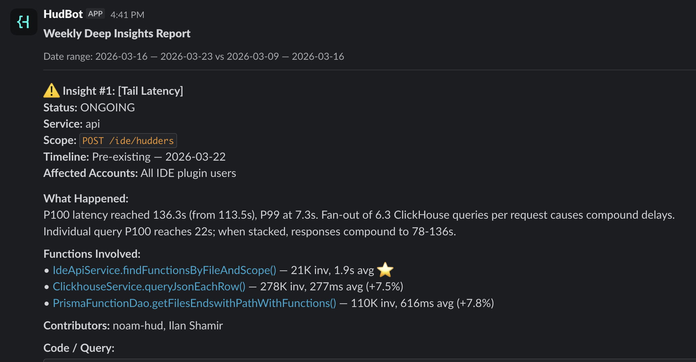

# Weekly Report

> A weekly Slack post summarizing what regressed in production, with proposed fixes and (optionally) a self-heal PR.

Every Monday morning the team gets a single Slack message: "here's what got worse last week, here's why, here's the fix, and a draft PR is already open." Engineers see the issue with their @-mention, click into the PR, and decide whether to ship it.

## Why teams use it

- **EM's "what's the state of prod" question** answered without a meeting.
- **Engineers see issues attributed to their changes** with a Slack ping — no triage queue.
- **Self-heal turns the report into action** — the highest-scoring fix is already a draft PR, removing the "I should fix that someday" pile-up.

## Available platforms

| Platform | Path | Notes |
|---|---|---|
| gh-aw | [`gh-aw/`](gh-aw/) | Markdown + YAML workflow on top of GitHub Actions. Posts to Slack. |

## Adapting it to your team

- **Different service layout** (not `apps/*/package.json`)? Edit Phase 0 in the workflow.
- **Multi-team setup** with one report per team? See [`recipes/team-splitting/3-package-json/`](../../recipes/team-splitting/3-package-json/) for the team-grouping pattern.
- **Different schedule** (daily / bi-weekly)? Adjust the cron in the workflow frontmatter.
- **Different chat platform** (Teams instead of Slack)? Replace Phase 6 — the rest of the pipeline writes to a markdown file that's chat-platform-agnostic.
