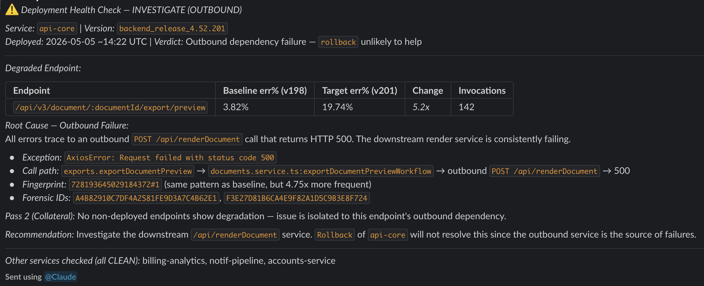

# Rollback Check (Claude Routine)

> Compare current vs. previous release health and recommend rollback / investigate / clean.

After a deploy, the question every SRE asks is "should I roll this back?" This routine answers it by comparing error rates, latency percentiles, and error fingerprints across versions, then tracing regressions to specific functions. Returns a verdict: ROLLBACK / INVESTIGATE_OUTBOUND / INVESTIGATE_ENVIRONMENTAL / WARN / CLEAN.

## How to install

| Variant | Step | Action |
|---|---|---|
| **Skill** | **Copy to your repo** | Copy `.claude/skills/rollback-check/SKILL.md` into your repo at the same path |
|  | **Configure locally** | Register Hud MCP: `claude mcp add -e HUD_MCP_KEY=$HUD_MCP_KEY --scope user --transport stdio hud -- npx -y hud-mcp@v2` |
|  | **Invoke** | In a Claude Code session, type `/rollback-check` |
| **Scheduled remote** | **Copy to your repo** | *(nothing - no files)* |
|  | **Register** | From a Claude Code session, use `mcp__scheduled-tasks__create_scheduled_task` with the prompt from `scheduled-remote/task.md` |
|  | **Configure** | Wire a delivery step (Slack / PagerDuty / webhook) for verdicts |

## Two variants

### Skill (on-demand, local)

A Claude Code skill. Invoked from a Claude Code session by an engineer (e.g. "run rollback-check on payments-api"). Lives in your repo at `.claude/skills/rollback-check/SKILL.md`.

**Best for:** incident response, pre-release gates, interactive exploration of the verdict.

### Scheduled remote (continuous, no human in loop)

The same prompt, registered as a scheduled remote task on Anthropic infrastructure. Fires on a cron and posts a verdict to Slack, PagerDuty, GitHub issue, or webhook.

**Best for:** continuous monitoring, hands-off deploy gates, multi-service fleets.

### Picking between them

| If you want... | Use |
|---|---|
| Kick off by hand during an incident | Skill |
| Run continuously without anyone invoking | Scheduled remote |
| Explore the verdict interactively | Skill |
| Gate every deploy automatically | Scheduled remote |

You can use both. The skill is for humans; the scheduled remote is for the machine.

Both prompts share the same analysis logic. If you change it, edit both files to keep them in sync.

## Adapting it

- **Different runner?** This example is Claude routine-specific. For a runner-agnostic version of the prompt (GitHub Actions, gh-aw, Cursor), see [`task-recipes/prompts/rollback-check.md`](../../task-recipes/prompts/rollback-check.md).
- **Different version-tag convention?** The version-discovery query reads `session_tags['service_version']`. Replace with whatever tag your services emit (e.g. `git_sha`, `release_id`).
- **No deployment events in Hud?** The workflow falls back to traffic-based ownership and time-based cohorts. No config changes needed.
- **Different verdict thresholds?** Edit the Step 5 decision matrix. The `Agent override` section already permits escalation outside the numeric thresholds when patterns warrant it.
- **Different output sink (not Slack)?** For the scheduled-remote variant, swap the delivery step. The structured `verdict` JSON is platform-agnostic.
